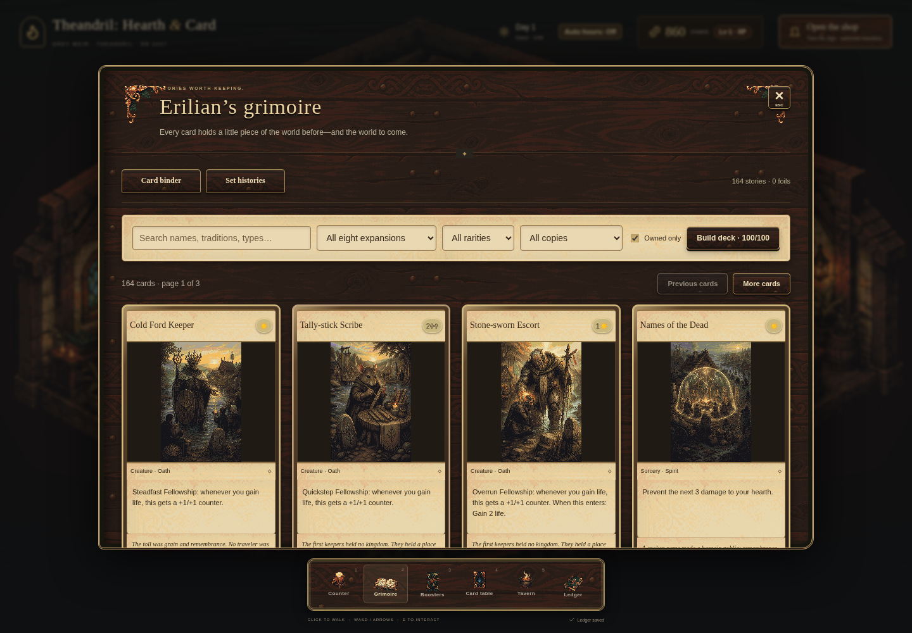

# Theandril: Hearth & Card

A cozy card tavern in **Theandril**, RR 2447, downstream of Grey Weir on the Sallow. Play **Erilian Kantonine**, Erik Burdett’s black-robed lich from **The Lich’s Tale**, in a fresh Three.js / React / TypeScript game. This is a playable foundation, with early card balance.

[Play in your browser](https://erikburdett.github.io/theandril-hearth-and-card/) · [Contribute](CONTRIBUTING.md) · [Roadmap](docs/RELEASE_READINESS.md) · [Report a bug](https://github.com/ErikBurdett/theandril-hearth-and-card/issues)



**Pre-1.0, single player.** No accounts or real-money purchases. Saves stay in your browser; export a backup from Ledger. MIT-licensed code, separately reserved artwork/world content: [license details](ASSET_LICENSE.md).

## Play locally

```sh
npx --yes pnpm@10.32.1 install --frozen-lockfile
npm run dev
```

Open http://127.0.0.1:5174. Node 22.12+; verified here on Node 26.7.0. No API keys or Python installation required. The server binds to loopback.

Click a clear aisle or use WASD/arrows to move between floor positions. Click a room station, press 1–5, or use the bottom dock to open its tabletop panel. E interacts nearby; Escape returns to the room. Open the shop to welcome customers. A world bell is four seconds while the browser is visible: 24 daylight bells followed by 24 night bells. Auto hours opens at dawn and closes at nightfall; changing the sign manually disables auto hours. Three open-shop bells deliver orders. The cellar continues through the night. Customer movement runs in fixed simulation steps; checkout makes the actual sale. There is no offline progression.

Use **Tavern** in the dock (5) to build the dining wing, equip its kitchen, and extend the brewer’s bar. The room visibly expands with the two new wings. Buy twelve kinds of ingredients at the marketplace, cook meals, or queue ale, mead and cider. Brews take 36–72 bells and can be sold to guests or cooked into higher-value dishes. Finished servings sell automatically when hungry or thirsty guests reach the serving area. Two starting skill points and one more per five purchases unlock six skills across storage, hospitality and craft. Capacity includes incoming stock and reserved brewing output; old saves retain their holdings.

## Working

- Open all sealed packs for any set, then review every pull in a scrolling haul window. Duplicate counts, rarity search, spare sales, deck edits and five-ordinary-to-one-Illuminated crafting are available there. Review last haul survives reload.


- Floating battle actions at the lower right, direct click-to-attack/block, highlighted spell-drop targets and per-aspect available resource counters. Hover reads cards; double-click a battlefield card for its story.
- Animated panels, card deals, pack flips, gilded/foil treatments, combat/health feedback and subtle tavern motion, respecting reduced-motion preference.
- Equal rarity policy across all eight sets; one guaranteed foil and a 5% Illuminated rare-slot frame upgrade per pack. Edition holdings persist and can be filtered in the grimoire.


- Complete paintings fit each art area without cropping. The laptop table fits both players and the hand on screen, with resources below companions, density-based card widths and larger hover previews.
- Twelve prepared recipes show missing-copy counts; six starter recipes are supplied, six more unlock through collection. Bard, beekeeper, ferryman, mason and archivist guests bring additional dialogue and deck plans.

- Full-art card faces throughout the binder, packs, reader, battle cards and hands, face-down opponent cards, drag-to-play with button alternatives, fourteen named opponents and twelve 100-card deck plans.
- A pausable 60-second decision clock and automatic pause while reading or away from the table. Basic and Special Resources produce mana.
- A twelve-book deck shelf: save, update, prepare and remove named 100-card recipes. Loading checks current ownership; recipes survive reload and JSON backups.
- The keeper’s First Chapters journal guides opening a pack, saving a deck, making a sale and winning a duel, with one-time crown rewards.

- Tavern-styled menus throughout: timber and brass panels, walnut gaming tables, inked card faces, matching controls and a keeper’s chronicle.
- The grimoire opens to **Card binder**. Switch to **Set histories** for the eight illustrated volumes, their eras, completion and uncertain records. Click a card name or picture to read its story; Escape closes the reader and returns to the book.
- The stock ledger distinguishes sealed inventory, deliveries and spare collection cards, with low-stock filtering and selectable order quantities. Packs open as face-down stories: turn them over one by one or reveal the whole pack. Cards are saved when the seal breaks.

- Persistent Three.js illustrated tavern, moving lich and fourteen medieval guests, greetings and browsing/checkout/departure behavior.
- Wholesale orders, shelves, pricing, customer demand, daily closing, crowns and renown.
- **8 sets × 80 cards = 640 card definitions**, with basic/special resources, creatures, instants, sorceries, artifacts, enchantments and **Heroes**. All fourteen lore traditions represented; five mana aspects.
- **14-card packs**, four rarities, explicit slot probabilities, guaranteed rare-or-mythic and foil slots. Foils persist independently of rarity. [Exact pack rules](docs/CARD_RULES.md).
- **100-card constructed decks**, four copies except unlimited basic resources; six included starter recipes with 40 resources each. Search, rarity/set filters, mana curves, colored sources, ownership and spare sales.
- 20-health new duels, resource-produced colored mana, exhaustion, arrival fatigue, instant responses, LIFO spell stack, attack/block decisions, nine combat keywords, recursion, permanent synergies, and Hero devotion abilities. Friendly AI uses the same rules. [Simplifications](docs/CARD_RULES.md#battle-format).
- Save schema 3, local storage, JSON import/export, deterministic RNG, live battle-stack and customer-route persistence. Versions 1/2 migrate collections and economy; old-format duels are archived in `legacyBattle` and restarted at the table without an entry fee.
- Theandril's actual pixel art factory, exact-hash approval gates and deterministic atlas. 25 sprite assets / 31 frames plus a separate room illustration. 640 individual full-art card illustrations use separate 256×384 reviewed exports.

## Development

```sh
npm test
npm run build
npm run test:gameplay
npm run format:check
npm run art:coverage
node --import tsx scripts/balance.ts
node --import tsx scripts/art.ts doctor
node --import tsx scripts/art.ts validate
node --import tsx scripts/art.ts atlas
```

Chromium tests use `/usr/bin/chromium`. Browser screenshots live in `docs/screenshots`. The diagnostic balance report is not a claim of balanced human matchups. Native Aseprite/Pixel Snapper executables were not found; retained exports are self-contained and no new native-tool run is claimed.

## Project map

- `src/content/`: card definitions, set identities, historical accounts, card vignettes, room navigation and customer roles.
- `src/sim/game.ts`: economy, packs, commands and saves; `battle.ts`: duel rules; `room.ts`: movement.
- `src/render/Tavern.tsx`: Three.js presentation, independent of authoritative rules.
- `src/ui/`: room HUD, collection, shop, pack opening and battle controls.
- `packages/art-pipeline/`: reused Theandril art factory.
- `scripts/art.ts`, `scripts/characters.ts`: reviewed-art preparation and publishing.
- `.agents/skills/hearth-card-design/`: project skill for sets, decks, packs and tactical rules, with primary-source research.
- `.agents/skills/hearth-release-finish/`: completion skill for playable acceptance checks, individual art review and honest release readiness.
- `scripts/card-briefs.ts`, `scripts/card-art.ts`: lore-linked per-card illustration briefs, deterministic processing, exact-hash approvals and full-catalog coverage checks.
- `docs/lore/theandril/`: lore snapshot at upstream `b17900d`.

Read [implementation status](docs/IMPLEMENTATION_STATUS.md), [project analysis](docs/PROJECT_ANALYSIS.md), [world and sets](docs/WORLD_AND_SETS.md), and [art workflow](docs/art/WORKFLOW.md) before extending the game.

This is a new local project; no GitHub repository was published or overwritten. Upstream material is reused at the owner's request; no new public license is asserted.


The grimoire’s **Set histories** now includes twelve faction folios from Theandril snapshot `b17900d`, linked card readings and clear distinctions between historical powers and modern successors. Search a faction name in the binder to find connected cards.

Drag the tavern background to pan; use the wheel, pinch, or +/− buttons to zoom (65–260%). Arrow buttons pan, and **Fit tavern** restores the overview. A click still walks; a drag does not issue a walking command. Upgraded dining and bar rooms now have visible stairs and open internal passages. Camera framing is presentation-only and resets on reload; saved actors follow the revised stair paths without replacing their simulation routes.

### Latest card and battle expansion

Each set now has 80 cards (640 total), with eight new full-art cards spanning every type. Binding/Renew, Rally/Drain, Rootfast/Daunt, Welcome/Recordwork and upkeep relics create new timing and deck-building options. The Open Door and Letters of Restraint are collectable prepared recipes. Eight new visitor sprites give all fourteen guests a distinct appearance. Attack-all selection, visible-board combat previews, unavailable-card explanations and a compact navigation dock improve laptop battles.

### Casting and autoplay

Drag an instant or sorcery onto a legal card/hearth/stack target, then press **Confirm**. Click a hand illustration (or Cast spell) and click a highlighted target for the same action. Retarget freely before confirming; Escape cancels without spending the card or mana. Heroes use the same confirmation step. Resources play directly onto your side.

Click **Start autobattles** beside the tavern card table, choose **Shuffle & autoplay** before a duel, or **Autoplay at the tavern** during one. Erilian walks to the table, then makes one decision every 850 ms. Drag the watch window by its title bar (arrow keys also work); it shows both boards, resources, the stack and your hand. Click its battle surface or **Open & take control** to pause and expand the current duel. Resume autoplay from the table or watch window. The opposing hand stays concealed. Autoplay stops in hidden tabs and during card inspection; no offline battles are simulated.


### The endless chronicle

Click the **Lv · XP** badge or open the Ledger for keeper progression and the mission tree. Choose objectives in the duelist, merchant and host branches; complete and claim each chapter to unlock the next. Battles and guest purchases earn XP, with growing crown and card rewards at every level. Autoplay chains fresh opponents immediately, with wins, losses and a central pause/play button in its watch window. Full menus hide the miniature while the active circuit continues. Foil cards catch pointer-responsive spectral light; inspect one for its animated Three.js finish.


### Animated tavern and tome artwork

Erilian and all fourteen guests have separate idle/walk poses. A reviewed 122-frame animation pack adds hearth flicker, lantern light, cooking steam, brewing foam, opening books/packs, card-back glints and ornate menu corners. All six dock entries use matching artwork. Foils now use a crisp narrow reflection without a diffuse color wash.

Runtime sheets: `public/art/animation/`. Retained source sheets and exact built-in image-generation prompts: `assets/art/source/animation/`. Processing, visual review and limitations are documented in `docs/art/WORKFLOW.md`. Rebuild reviewed animation exports with `npm run art:animations -- atlas`.

Menus and cards now share aged parchment, bound leather and embossed brass controls. Card paintings appear once in a fitted art window; layered edges and lift/press/settle motion add weight. The project's `hearth-visual-design` skill defines the material, readability and motion standards.

The walnut workshop expands hospitality to 15 recipes, six upgrades and four endless mission branches. Use Tavern → Kitchen & cellar to search recipes, filter what you can prepare, and buy missing raw supplies at the displayed cost. Stone oven and cellar refits unlock premium dishes and reserve brews. The artisan branch in Ledger rewards completed batches. New generated parchment and walnut materials replace the remaining green interface surfaces.

## Hosting and production

The production build contains about 26 MiB including all 640 card illustrations, using pixel-identical lossless WebP. Unused tavern wings load only when unlocked. Full-resolution originals and review images are optional versioned release archives, not part of the deployed site. See [contribution setup](CONTRIBUTING.md), [hosting options](docs/HOSTING.md), and [optimization evidence](docs/PERFORMANCE.md).

GitHub Actions runs rules, format, browser and project-path production checks before publishing main to Pages. Paid inventory, accounts, cloud saves and monetization are not implemented.
